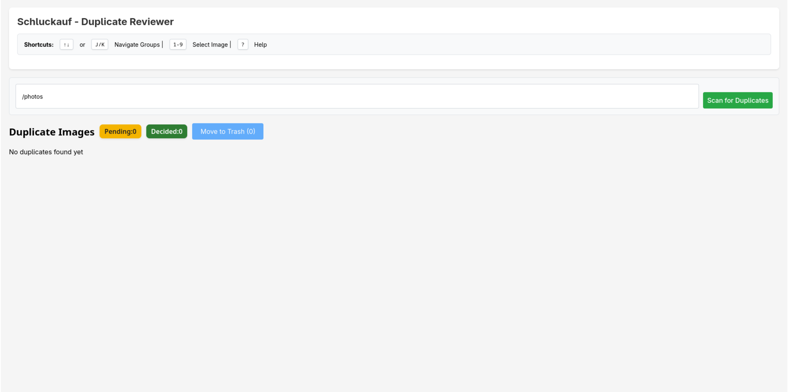
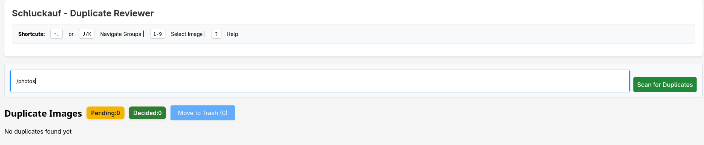
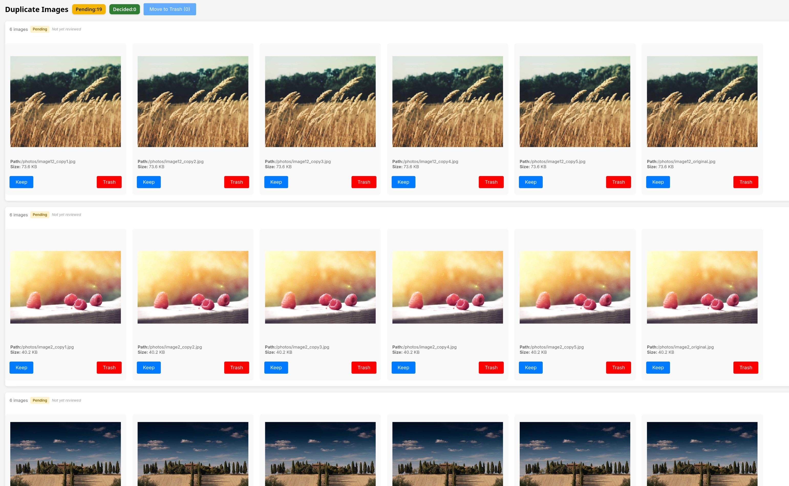
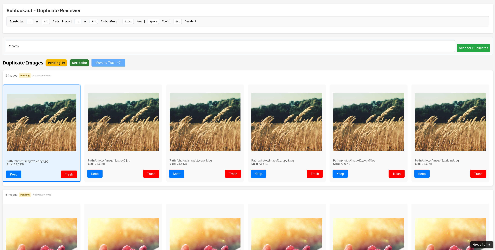
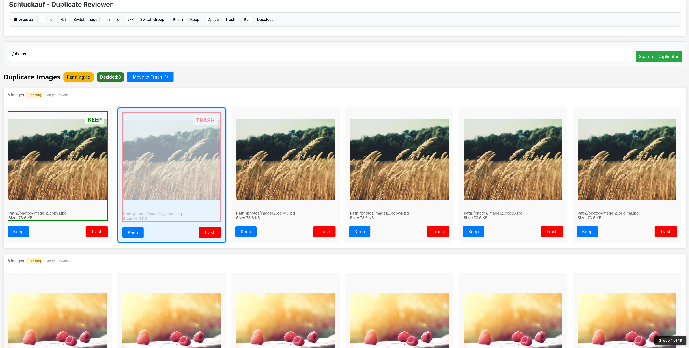
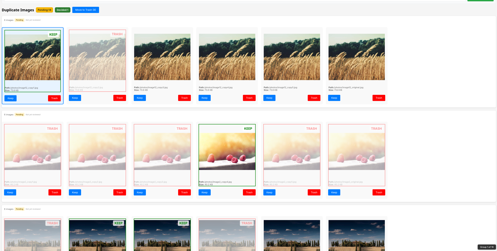
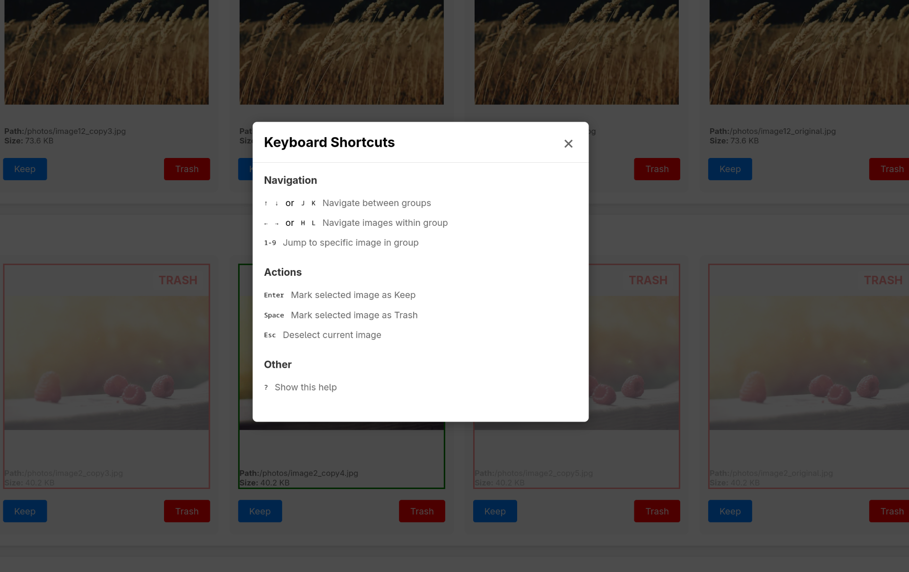
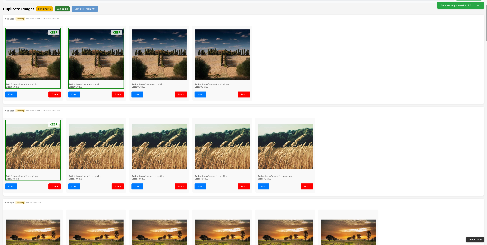
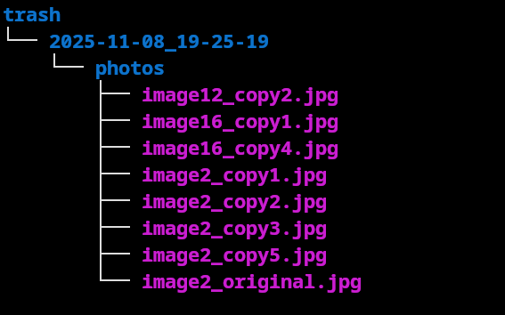

# Schluckauf Demo Walkthrough

This document provides a complete visual walkthrough of Schluckauf's duplicate photo review workflow.

## Table of Contents

1. [Initial Setup](#1-initial-setup)
2. [Scanning for Duplicates](#2-scanning-for-duplicates)
3. [Reviewing Duplicate Groups](#3-reviewing-duplicate-groups)
4. [Navigating and Selecting Images](#4-navigating-and-selecting-images)
5. [Making Decisions](#5-making-decisions)
6. [Tracking Progress](#6-tracking-progress)
7. [Keyboard Shortcuts Reference](#7-keyboard-shortcuts-reference)
8. [Moving Files to Trash](#8-moving-files-to-trash)
9. [File Safety Verification](#9-file-safety-verification)

---

## 1. Initial Setup

When you first open Schluckauf, you'll see the empty state with the scan form ready.

---

## 2. Scanning for Duplicates

Enter the directory path you want to scan (e.g., `/photos`) and click "Scan for Duplicates".

**How it works:**

- Enter any mounted directory path
- Schluckauf runs Czkawka CLI in the background
- Results are parsed and loaded into the database
- Page automatically refreshes with results

**Note:** Only scan directories mounted in the Docker container for image display to work.

---

## 3. Reviewing Duplicate Groups

After scanning, all duplicate groups are displayed as a scrollable list.

**What you see:**

- Multiple duplicate groups displayed
- Each group shows all similar/duplicate images side-by-side
- Image count per group (e.g., "6 images")
- Group status (Pending/Decided)
- Updated stats at the top

**Navigation:**

- Use `J`/`K` or `↑`/`↓` arrow keys to navigate between groups
- Smooth scrolling automatically brings groups into view

---

## 4. Navigating and Selecting Images

Select individual images within a group using keyboard shortcuts.

**What you see:**

- Selected image highlighted with visual border
- Progress indicator in bottom-right corner (e.g., "Group 3 of 20")
- Keyboard shortcut hints at the top
- Action buttons (Keep/Trash) visible

**Navigation within groups:**

- Press `1-9` to jump directly to an image
- Use `H`/`L` or `←`/`→` to navigate between images
- Selected image auto-scrolls into view
- Press `Esc` to deselect

**Progress tracking:**

- Fixed position indicator stays visible while scrolling
- Shows current group number and total count
- Updates in real-time as you navigate

---

## 5. Making Decisions

Mark images as "Keep" (green) or "Trash" (red) to decide which duplicates to remove.

**What you see:**

- Green "Keep" badge on images you want to preserve
- Red "Trash" badge on images you want to delete
- Multiple decisions can be made within the same group
- Visual distinction makes decisions clear at a glance

**Keyboard shortcuts:**

- `Enter` - Mark selected image as Keep
- `Space` - Mark selected image as Trash
- Decisions are saved instantly to the database
- Persist across browser sessions

**Best practice:**

- Review all images in a group before moving on
- Use keyboard shortcuts for speed

---

## 6. Tracking Progress

The stats section shows your review progress in real-time.

**What you see:**

- **Pending:** Number of groups not yet fully reviewed
- **Decided:** Number of groups where decisions were made
- **Move to Trash button:** Shows count of images marked for deletion
- Button becomes enabled when trash count > 0

**How groups are marked "Decided":**

- A group is "decided" when all images have a Keep or Trash decision
- Decided groups are visually dimmed to show completion
- Stats update instantly as you make decisions **Note** Group decisions update only at page reload

---

## 7. Keyboard Shortcuts Reference

Press `?` to open the help modal showing all available keyboard shortcuts.

**Available shortcuts:**

**Navigation:**

- `↑` `↓` or `J` `K` - Navigate between groups
- `←` `→` or `H` `L` - Navigate images within group
- `1-9` - Jump directly to specific image

**Actions:**

- `Enter` - Mark selected image as Keep
- `Space` - Mark selected image as Trash
- `Esc` - Deselect current image (or close help modal)

**Help:**

- `?` - Show/hide this help modal

**Closing the modal:**

- Press `Esc`, click the X button, or click outside the modal

---

## 8. Moving Files to Trash

When you're done reviewing, click "Move to Trash" to safely move marked files.

**What happens:**

- Files marked as "Trash" are physically moved from `/photos` to `/trash` directory
- Files are **NOT permanently deleted** - they can be restored from trash
- Success message shows how many files were moved
- Stats reset (trash count returns to 0)
- Decided groups remain visible with their decisions

**Safety features:**

- Files are moved, not deleted
- Easy to restore if you change your mind
- Database tracks all operations
- Error handling shows which files failed (if any)

---

## 9. File Safety Verification

Verify that trashed files are safely preserved in the trash directory.

**What you see:**

- Terminal output showing contents of `./trash` directory
- All trashed files are present and intact
- Original filenames preserved
- Files can be manually restored or permanently deleted later

**Trash management:**

- Review trash contents before permanently deleting
- Restore files by moving them back to original location
- Clean up trash manually when ready
- No automatic deletion - you have full control

---

## Workflow Summary

1. **Scan** → Enter directory path and scan for duplicates
2. **Navigate** → Use `J`/`K` to move between groups
3. **Select** → Use `1-9` or `H`/`L` to select images
4. **Decide** → Press `Enter` (Keep) or `Space` (Trash)
5. **Track** → Monitor progress with stats and counter
6. **Execute** → Click "Move to Trash" to apply decisions
7. **Verify** → Check trash folder to confirm safety

**Speed:** With keyboard shortcuts, review 100+ duplicate groups in under 5 minutes!

---

## Tips for Efficient Review

- **Use keyboard exclusively** - Faster than clicking
- **Review in batches** - Complete 10-20 groups, then move to trash
- **Mark keepers first** - Easier to see what's left
- **Use the progress counter** - Track how far you've gone
- **Press `?` anytime** - Quick reference for shortcuts
- **Complete before rescanning** - Rescanning clears all data

---

## Next Steps

- See [README.md](README.md) for setup instructions
- See [ROADMAP.md](ROADMAP.md) for planned features
- See [CONTRIBUTING.md](CONTRIBUTING.md) to contribute

Happy reviewing! 📸
